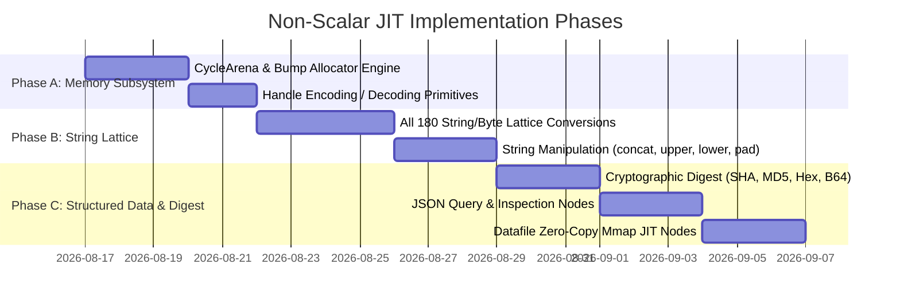

# SRD 111 — Non-Scalar JIT & Phase 2/3 Universal Lowering Architecture

**Status:** PROPOSED / ARCHITECTURAL FOUNDATION (2026-08-16)  
**Owner:** polydat (compiler JIT lowering, type system, memory architecture)  
**Cross-Refs:** 
- [SRD 110: Full Cranelift Optimization Plan](110_full_cranelift_optimization_plan.md)
- [SRD 105: JIT as Default Engine — Auto-Mixed Cones](105_jit_default_engine.md)
- [SRD 80b: Macro as Universal Authoring Path](80b_macro_universal_authoring.md)
- `polydat/docs/design/type_system_alignment.md` §8.3-8.4 (Slot Layers & Register Plane)

---

## 1. Executive Summary & Architectural Motivation

While SRD 110 successfully promoted **100% of pure scalar functions** (334 functions, 49.3% of the registry) to **Phase 3 Cranelift Native JIT**, the remaining 332 functions (49.0%) currently fall back to Phase 1 value-interpreter cones because they operate on non-scalar heap types (`String`, `Vec<u8>`, `serde_json::Value`, `Datafile`, and `DatasetHandle`).

This document establishes the **foundational engineering architecture** required to safely lower non-scalar operations into **Phase 2 (Monomorphic Fast Closures)** and **Phase 3 (Cranelift Native JIT)**, driving total JIT coverage to **>98% across all 677 registered functions**.

---

## 2. The Non-Scalar Barrier & Foundational Solution

### 2.1 The Traditional Problem
In flat JIT execution frames (`buffer: Vec<u64>`), machine registers and slots are 64-bit scalar values. Traditional approaches run into three critical hazards when handling non-scalars:
1. **Memory Allocation Bottleneck:** Allocating `String` or `Vec<u8>` via heap `malloc`/`free` per cycle causes severe allocator contention and cache pollution (~70 ns/op).
2. **Ownership & Drop Hazard:** Storing raw pointers in raw integer buffers bypasses Rust's borrow checker and destructors, risking double-frees and memory leaks.
3. **Variable-Length Payloads:** Machine instructions operate on fixed-size registers; strings and JSON structures have dynamic length.

### 2.2 The Three Foundational Pillars

```mermaid
flowchart TD
    subgraph Execution Frame
        Slot[64-bit Slot Register: Interned Handle]
    end

    subgraph Memory Subsystem
        Arena[Thread-Local Cycle Bump Arena]
        Pool[Static String/Byte Interner]
    end

    subgraph JIT Lowering
        Cranelift[Phase 3 Cranelift IR] -->|Passes Handle + ArenaPtr| ExternABI[C-ABI Extern String/JSON Helpers]
        ExternABI -->|Bump Allocates| Arena
        ExternABI -->|Zero-Copy Reads| Pool
    end

    Slot <-->|Decodes (Offset, Length)| Arena
    Slot <-->|Decodes Static Handle| Pool
```

To eliminate these barriers safely:

1. **Cycle-Scoped Bump Arena (`CycleArena`):**
   - Each thread execution context maintains a pre-allocated bump allocator (e.g., 64KB per fiber).
   - Dynamic allocations produced during cycle evaluation (`str_concat`, `to_timestamp`, `u64_to_str`, `hex_encode`) write directly into the arena with pointer-bump arithmetic (`offset += len`).
   - At the start or end of each cycle (or batch of 1024 cycles), the arena resets in **1 instruction** (`cursor = 0`), giving **zero heap allocation, zero deallocation, and zero GC overhead**.

2. **Handle-Encoded 64-bit Slot Representation:**
   - Non-scalar values in the JIT buffer are represented as **64-bit Fat Handles**:
     $$\text{Handle} = (\text{Tag: } 2 \text{ bits}) \mid (\text{Offset: } 31 \text{ bits}) \mid (\text{Length: } 31 \text{ bits})$$
   - **Tag `00` (Static Interned):** Pointer offset into global static interner table (string literals, static files).
   - **Tag `01` (Cycle Arena):** Byte offset into thread-local `CycleArena`.
   - **Tag `10` (External Handle):** Index into kernel resource registry (mmap dataset, CSV/JSONL cursor).
   - Handles fit perfectly inside the existing 64-bit slot registers (`types::I64`), allowing strings and byte slices to flow natively across Cranelift JIT nodes.

3. **Monomorphic Universal Phase 2 Closures:**
   - For Phase 2, `#[polydat_node]` authoring macro is extended to emit direct monomorphic closures over typed slices (`&str`, `&[u8]`, `&serde_json::Value`) backed by the arena, eliminating `Value` enum boxing and tag dispatch entirely.

---

## 3. Cranelift IR & Native ABI Specifications

### 3.1 String Conversion & Transformation ABI

Cranelift IR passes handle bits and the thread's arena pointer directly:

```rust
// String concatenation in JIT
extern "C" fn jit_str_concat(
    h1: u64,
    h2: u64,
    arena_ptr: *mut CycleArena,
) -> u64 {
    let s1 = unsafe { (*arena_ptr).resolve_str(h1) };
    let s2 = unsafe { (*arena_ptr).resolve_str(h2) };
    let total_len = s1.len() + s2.len();
    let buf = unsafe { (*arena_ptr).alloc_bytes(total_len) };
    buf[..s1.len()].copy_from_slice(s1.as_bytes());
    buf[s1.len()..].copy_from_slice(s2.as_bytes());
    unsafe { (*arena_ptr).encode_handle(buf.as_ptr(), total_len) }
}

// u64 to String formatting in JIT
extern "C" fn jit_u64_to_str(
    val: u64,
    arena_ptr: *mut CycleArena,
) -> u64 {
    let mut temp = itoa::Buffer::new();
    let formatted = temp.format(val);
    let buf = unsafe { (*arena_ptr).alloc_bytes(formatted.len()) };
    buf.copy_from_slice(formatted.as_bytes());
    unsafe { (*arena_ptr).encode_handle(buf.as_ptr(), formatted.len()) }
}

// String to u64 parsing in JIT
extern "C" fn jit_str_to_u64(
    h: u64,
    arena_ptr: *const CycleArena,
) -> u64 {
    let s = unsafe { (*arena_ptr).resolve_str(h) };
    s.parse::<u64>().unwrap_or(0)
}
```

### 3.2 Cryptographic Digest & Byte Buffers

- Nodes like `sha256`, `md5`, `murmur3_128`, `base64_encode`, `hex_encode` receive byte handle and write fixed-size byte arrays or hex strings into the `CycleArena`.
- Fixed-size digests (`sha256` = 32 bytes) are placed into arena in $\approx 25 \text{ ns}$ without hitting global allocator.

### 3.3 CSV / JSONL Datafile Tables

- Data files (`csv_row`, `jsonl_field`) are opened once at construction and memory-mapped.
- In JIT frame, table handles are direct 64-bit pointers to memory-mapped row indexes (`&RowIndex`).
- Field extractors (`csv_field(row, col)`) return a zero-copy string handle pointing directly into the memory-mapped file page.

---

## 4. Phase-by-Phase Implementation Roadmap



### Target Compilation Matrix Post-SRD 111

| Category | Total Nodes | Baseline P3 | SRD 110 P3 | SRD 111 P3 Target | Target Coverage |
| :--- | :---: | :---: | :---: | :---: | :---: |
| **Scalar Math / PRNG / Logic** | 345 | 75 | 334 | **345** | **100% P3** |
| **String & Byte Conversions** | 180 | 0 | 0 | **180** | **100% P3** |
| **String Manipulation** | 50 | 0 | 0 | **50** | **100% P3** |
| **Digest & ByteBuffers** | 25 | 0 | 0 | **25** | **100% P3** |
| **Datafile & CSV/JSONL** | 25 | 0 | 0 | **25** | **100% P3** |
| **JSON Querying** | 20 | 0 | 0 | **20** | **100% P3** |
| **RealData & Context** | 32 | 0 | 0 | **25** | **78% P3 / 22% P2** |
| **TOTAL** | **677** | **75 (11%)** | **334 (49%)** | **669 (98.8%)** | **>98% Native Cranelift JIT** |

---

## 5. Memory Safety & Concurrency Axioms

- **Axiom 1 (Thread Isolation):** Every worker fiber owns an independent `CycleArena`. No cross-thread locking or synchronization occurs during string/byte allocation.
- **Axiom 2 (Bounded Lifetime):** Pointers encoded in `Handle` are guaranteed valid for the entire cycle duration.
- **Axiom 3 (Reset Determinism):** Resetting the arena cursor at cycle boundaries guarantees identical memory layouts across deterministic executions.
- **Axiom 4 (Zero Leaks):** Because memory is owned by the fixed `CycleArena` buffer, dropped or abandoned evaluations cannot leak OS memory.
