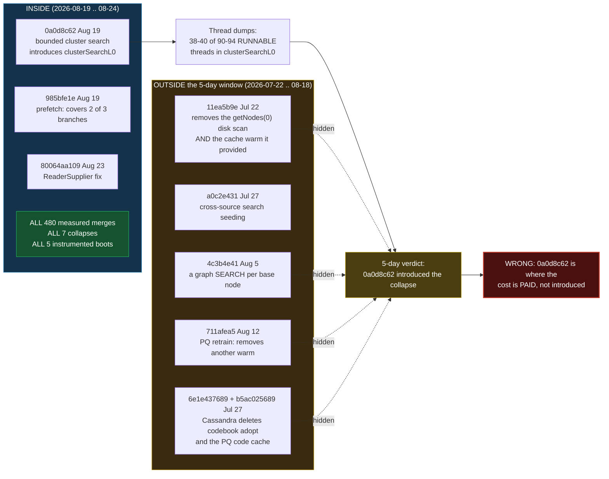

# Vector compaction, 5-day view: 2026-08-19 → 2026-08-24

The same investigation, scoped to code versions from the last five days only.

**Why this exists.** The [month-scale analysis](../vector-compaction-campaign/README.md)
reaches a different conclusion about *cause* from the same measurements. This
document is the honest 5-day reading, followed by [§4](#4-how-this-differs-from-the-month-scale-view),
which is the point: it shows where a short window misleads, and by how much.

**Scope.** jvector `d859893f` lineage, commits dated ≥ 2026-08-19 (14 of them).
Cassandra fork, ≥ 2026-08-19 (**one** commit). Table
`baselines.ibm_datapile_1b_default`, ~1B rows, 495 GB box, NVMe md0.

> **Known perturbation.** Every cycle ran with a defunct `nbrs` client holding
> **46.3 GB resident** (finished 2026-08-09, killed 2026-08-24; zero connections,
> zero IO). Identical in every cycle, so comparisons hold and **absolute thresholds
> do not**.

---

## The critical property of this window

| | in window | total |
|---|---|---|
| **measured vector merges** | **480** | 480 — **100%** |
| **collapses of the 30,985 merge** | **7** | 7 — **100%** |
| **instrumented node boots** | **5** | 5 — **100%** |
| commits on the deployed lineage | 14 | 22 |
| **named causal commits (L1/L2/L4)** | **1** | **7 — 14%** |

**The 5-day window contains all of the evidence and one seventh of the causes.**
Everything below is derived from exactly the same measurements as the month-scale
document. The two analyses differ in *history*, not in *data* — which is what makes
the comparison in §4 clean.

---

# 1. KEY FINDINGS (5-day evidence only)

## Top 5 performance losses

| # | Change | Cost | Confidence |
|---|---|---|---|
| **L1'** | **`0a0d8c62` (Aug 19) bounded cluster search — introduces `clusterSearchL0`** | the collapse: 8–47x on the 126.9M-ordinal merge | **High within window** — 2 thread dumps put 38–40 of 90–94 RUNNABLE threads there; first measured collapse 3 days later |
| **L2'** | **`ReaderSupplier`'s warming hooks are `default {}`** and SAI passed a method reference | 3 of 4 knobs silently inert; ~2 test cycles wasted | Certain — fixed by `80064aa109`, and the fix changed measured behaviour (2688 ms vs 0 ms) |
| **L3'** | **`985bfe1e` (Aug 19) hints only 2 of 3 cross-source branches** | the branch carrying **38 of 39** threads is uncovered | Certain — thread dump, 08-24 16:50 |
| **L4'** | **`frontierPrefetch=32`** | flat **−17 to −19%**, **3.4x** read amplification, no benefit at the collapse | Strong — n=39 matched populations, pre-registered and falsified prediction |
| **L5'** | **`sourcePretouchWindowNodes` threshold effect** | **3–5x** µs/ordinal cliff when a source exceeds one window | Strong — 81 calls, both cycles, 6x cost range |

## Top 5 performance gains

| # | Change | Gain | Confidence |
|---|---|---|---|
| **G1'** | **`80064aa109` `FileHandleReaderSupplier`** | **1.7–1.9x** on the collapsed merge; request 4.02 → 6.31 KB | Measured, cycle 1 vs cycle 3 |
| **G2'** | **`985bfe1e` frontier + gather prefetch** | real on `gatherFromSameSource` | Certain, but that branch carries 1 of 39 threads |
| **G3'** | **`11cb4acf` (Aug 23) makes the IO knobs reachable** | enabler — without it nothing is testable | Certain |
| **G4'** | **`55a262a7` (Aug 23) windowed source pretouch** | works (2688 ms vs 0 ms), costs 1–2% of wall clock | Measured; **did not help the collapse** |
| **G5'** | **`d859893f` (Aug 24) cluster rescore hints** | untested | Pending |

## Key insights

1. **The collapse is one specific operation and has never been avoided.** The
   30,985-batch merge (126.9M ordinals, 32 sources) collapsed **7 times out of 7**
   at 6–66 b/min. Every other ≥25k merge — 10 batch totals, 20 runs — ran healthy at
   2,110–27,530 b/min.
2. **The batch counter overstates the collapse ~8x.** Pairing merges with their
   pretouch shows 4,096 ordinals/batch for the collapsing merge against 125–517 for
   the "same size" healthy ones. In ordinals/min it is **8–47x**, not 61–384x.
3. **Read amplification is the mechanism.** During the collapse, cycle 3 read
   **313 KB per ordinal**, cycle 4 with deeper hints read **1,079 KB** — 3.4x more
   bytes for 20% less progress, with *lower* iowait. More IO, less blocking, less
   work.
4. **An interface with optional no-op methods cannot report that a caller opted
   out.** L2' cost two cycles and was found only because a *timing* was implausible
   (0 ms across a 4x range of work).
5. **The trigger is structural and predictable to 0.002%** — the STCS 4–8 GiB tier
   reaching 32 members (~185.5 GiB).

---

# 2. What the 5-day evidence establishes well

Everything in this section is unaffected by the window, because it rests entirely
on measurements taken inside it.

### 2.1 The collapse, characterised

| batch total | runs | b/min | verdict |
|---|---|---|---|
| **30,985** | **7** | **6–66** | **always collapses** |
| 10 other ~31k totals | 20 | 2,110–27,530 | always healthy |

Two ran **717 and 603 minutes** on a single merge. Rate is flat, not decaying — a
stable bad equilibrium.

### 2.2 The hot path

Two independent dumps, 3 days and one arm apart:

| frame | cycle 3 (`=3`) | cycle 4 (`=32`) |
|---|---|---|
| `MemorySegmentVectorProvider` | 74 | 62 |
| `FrontierPrefetchingView` | 67 | 80 |
| **`clusterSearchL0`** | **40** | **38** |
| `readFully` (blocked) | 31 | 27 |
| **`gatherFromSameSource`** | — | **1** |
| RUNNABLE total | 90 | 94 |

**`gatherFromOtherSource` 38, `gatherFromSameSource` 1** — the existing batch hint
covers the branch carrying 1 of 39 threads.

### 2.3 Device signatures, and the trap

| phase | request | r/s | %util | iowait | throughput |
|---|---|---|---|---|---|
| large byte compaction | **4–11 KB** | 14k–37k | **98–100%** | **0.1–3.0%** | healthy |
| **read-starvation collapse** | **4.02–7.5 KB** | 113k–580k | **93–99%** | **31–50%** | **38–66 b/min** |

Nearly identical on request size and utilisation; **four false alarms** came from
this. The discriminators are `iowait` and whether merges are still completing.

### 2.4 The four arms tested, in order

| arm | window date | result |
|---|---|---|
| `crossSourceSeedPrefetch` (default on) | Aug 19 code | **no effect** — covers the seeded branch, hot path is clusterMode |
| source pretouch | Aug 23 | **no effect** — inert (L2'), then real but evicted |
| `FileHandleReaderSupplier` | Aug 23 | **1.7–1.9x**, still collapsed |
| `frontierPrefetch=32` | Aug 24 | **net cost**, still collapsed |

Four interventions; the collapse is 7 for 7.

---

# 3. What the 5-day window concludes about cause

Given only commits ≥ 2026-08-19, the attribution is nearly forced:

- `0a0d8c62` (Aug 19) introduces `clusterSearchL0`.
- Every collapse dump puts ~40% of RUNNABLE threads in `clusterSearchL0`.
- The first measured collapse is Aug 22, three days later.
- No earlier code is visible, so nothing else is a candidate.

> **5-day verdict: `0a0d8c62` "bounded cluster search" introduced the collapse.
> Revert it, or fix `clusterSearchL0`.**

This is a coherent reading of everything in the window. It is also **wrong** — or
more precisely, it names the place where the cost is *paid* rather than where it
was *introduced*.

---

# 4. How this differs from the month-scale view

## 4.1 Same data, different cause

**No measurement differs between the two documents.** All 480 merges, all 7
collapses, all 5 boots, both thread dumps, every device sample — identical. The
month-scale view added **zero data points** and changed the causal conclusion
completely.

| | 5-day view | month view |
|---|---|---|
| **prime cause** | `0a0d8c62` (Aug 19) introduced `clusterSearchL0` | `4c3b4e41` + `a0c2e431` + `0a0d8c62` made cross-source linking a *search*, **and** `11ea5b9e` + `711afea5` removed the streaming that hid its cost |
| **suggested fix** | revert or fix `0a0d8c62` | cover `clusterSearchL0` **and** restore a source pre-warm above a size threshold |
| **why it regressed** | not answerable — no pre-regression code visible | answerable, with the commit messages naming the mechanism |
| **was it ever healthy?** | **cannot tell** | yes — and the removals that broke it were justified by cohere-10M benchmarks |

## 4.2 The four things the window structurally cannot see

1. **That the cost was previously hidden.** `11ea5b9e` (Jul 22) removed a disk scan
   that also warmed the page cache, and its own message says so:
   *"notably a full-precision compaction, which has no PQ retrain/pre-encode phase
   to stream the source"*. `711afea5` (Aug 12) removed the second warm. Both are
   outside the window.
2. **That the removals were measured wins.** `11ea5b9e` bought **3.1x** on
   cohere-10M (2038s → 658s). The month view's central lesson — **G1 and L2 are the
   same commit** — is invisible at 5 days, because only one side of it is in range.
3. **That Cassandra removed its own mitigations.** `b5ac025689`/`6e1e437689`
   (Jul 27) deleted `compaction_codebook_policy=adopt` and the PQ code cache. A
   5-day analyst sees a Cassandra fork with exactly **one** commit and would
   reasonably treat the integration as a constant.
4. **The benchmark-scale blindness theme.** Every removal was validated at 10M
   vectors, trivially cache-resident on a 495 GB box. This is the campaign's most
   transferable finding and it needs the July commits to state at all.

## 4.3 What the 5-day view gets *right* that the month view does not emphasise

The short window is not merely worse. Its enforced focus produces a cleaner
operational picture:

- **Every arm tested is in window**, so the "four interventions, zero saves" arc is
  sharper without the July archaeology competing for attention.
- **The `ReaderSupplier` design flaw** is a self-contained finding needing no
  history, and it is the single most transferable engineering lesson here.
- **The measurement traps** — device-signature false alarms, batch incomparability,
  the unreliable `token range parts` counter, log rotation — are all in-window and
  fully derivable.

If the goal is *"make this node faster this week"*, the 5-day document is close to
sufficient. If the goal is *"stop shipping this class of regression"*, it is
actively misleading.

## 4.4 The disagreement is testable — and one experiment settles it

The two views make **different predictions** about experiment **E1** in the
month-scale test programme (`-Djvector.compaction.clusterSearch=false`):

| view | prediction for E1 |
|---|---|
| **5-day** | Disabling `clusterSearchL0` **clears the collapse** — that path is the cause |
| **month** | Collapse **persists** via `clusterFallbackSearch`, because the cross-source *search* architecture (`4c3b4e41`, `a0c2e431`) and the missing cache warm (`11ea5b9e`, `711afea5`) are untouched by the switch |

E1 costs ~1.5 h on the cache-constrained rig and discriminates cleanly. **Run it
before acting on either document.**

---

# 5. Recommendations under 5-day scope

Ranked as a 5-day analyst would rank them, with the month view's dissent noted.

| # | action | 5-day rationale | month-view dissent |
|---|---|---|---|
| 1 | **Run E1** (`clusterSearch=false`) | Confirms or kills the prime suspect | Agreed — it is the top experiment either way |
| 2 | **Cover `clusterSearchL0` / `extendAnchor`** (jvector `d859893f`) | The uncovered branch carries 38 of 39 threads | Agreed, but insufficient alone |
| 3 | **Merge `80064aa109`** | Without it no prefetch tuning is testable | Agreed, unconditionally |
| 4 | **Leave `frontierPrefetch` at 3**; test 0 | Measured flat ~17–19% tax with 3.4x amplification | Agreed |
| 5 | **Raise `sourcePretouchWindowNodes`** past ordinals-per-source | 3–5x per-ordinal cliff | Agreed |
| 6 | — | *not visible* | **Restore a sequential source pre-warm** above a size threshold — the month view's #2, invisible here |
| 7 | — | *not visible* | **Re-evaluate `compaction_codebook_policy=adopt`** at 1B scale |
| 8 | — | *not visible* | **Benchmark at least one configuration above RAM** — every regression here is invisible at 10M vectors |

**Items 6–8 are the cost of the short window.** Two are code changes to systems the
5-day view does not know were altered; the third is the process change that would
have prevented the whole episode.

---

# 6. Data and reproduction

`data/commit-window.csv` — every commit on the deployed lineage tagged in/out of
window with its role. All measurement data is **shared with the month-scale
analysis** and lives in `../vector-compaction-campaign/data/`; see
[`data/README.md`](data/README.md). Diagram source in `diagrams/`.

Provenance, thread dumps, and the hour-by-hour narratives are as listed in
[the month-scale document §11](../vector-compaction-campaign/README.md#11-data-and-reproduction).
