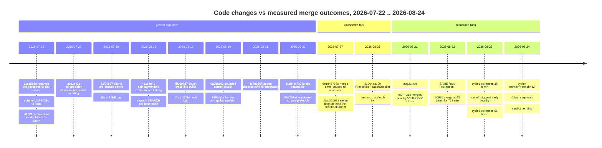
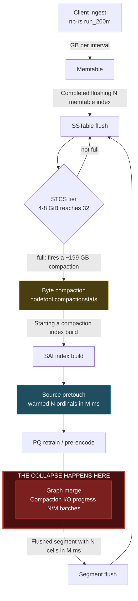
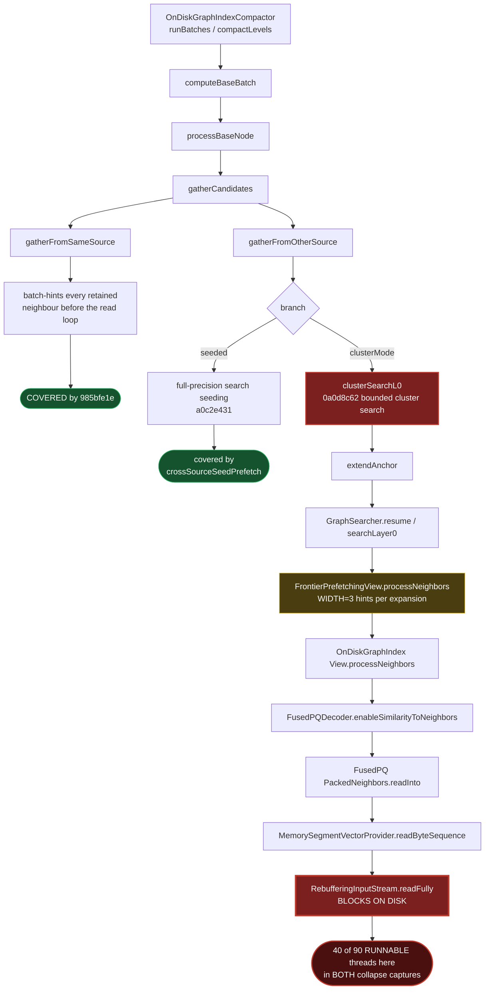
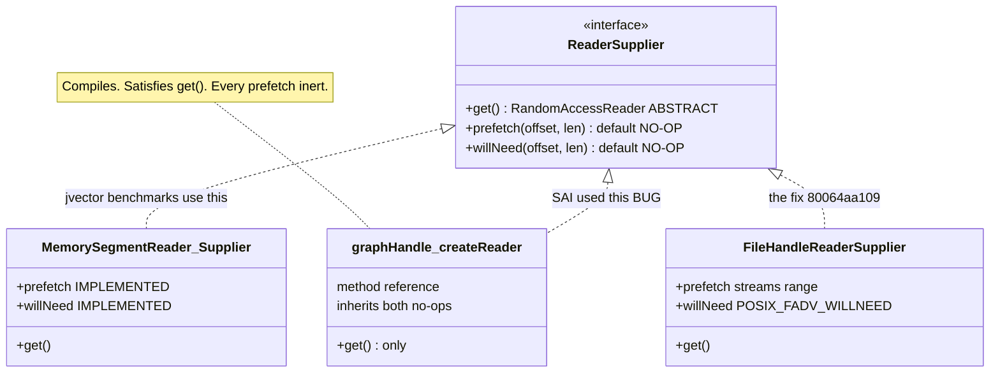
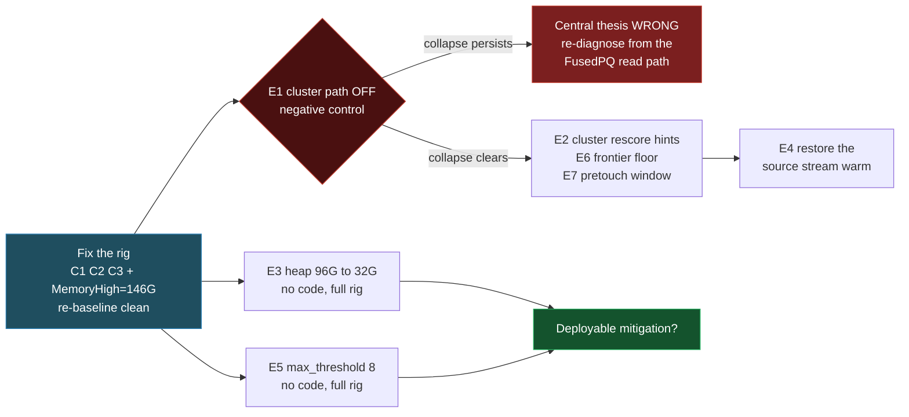

# Vector compaction: one month of changes, what each one cost, and where

Analysis of the SAI vector-merge IO collapse on `jvector-rc-jshooks-cassandra-1`,
covering **2026-07-22 → 2026-08-24**: 16 jvector commits, 2 Cassandra fork commits,
5 instrumented node boots, and 480 measured vector merges.

**Scope.** jvector `4.0.1-SNAPSHOT` against a Cassandra fork
(`dse-db-4.0.11.0-SNAPSHOT`), table `baselines.ibm_datapile_1b_default`, ~1B rows,
495 GB box, NVMe md0.

**Companion document.** [`../vector-compaction-5day/`](../vector-compaction-5day/README.md)
is the same investigation scoped to the last five days of code. It uses **identical
measurements** and reaches a **different conclusion about cause** — worth reading for
what a short window does to attribution, and because the two make opposing,
testable predictions about experiment E1 in §12.

**Evidence boundary.** Code history from git (full month). Compaction logs retained
from **2026-08-17**; the first vector merges appear 2026-08-21. Session artefacts
from 2026-08-05. Anything earlier is commit-message evidence only and is marked as
such.

> **Known perturbation.** Every cycle ran with a defunct `nbrs` client (pid 539210,
> finished 2026-08-09, killed 2026-08-24) holding **46.3 GB resident**. It had zero
> connections to Cassandra and did zero IO, so it was a memory occupant rather than
> a traffic source, and the deficit was identical in every cycle — **comparative
> results hold, absolute thresholds do not.** Wherever this document gives an
> absolute figure for "the table size at which the collapse happens" or an
> index/cache ratio, read it as measured on a box with 46 GB spuriously pinned.
> See §12.0(a).

Every number is recomputed from `data/*.csv` by
[`data/extract.py`](data/extract.py) and
[`data/extract_history.py`](data/extract_history.py). Provenance for each run is
recovered from Cassandra's own startup logging — see
[`data/provenance.csv`](data/provenance.csv).

---

# KEY FINDINGS

## Top 5 performance losses

| # | Change | Cost | Where it hits | Evidence |
|---|---|---|---|---|
| **L1** | **`4c3b4e41` + `a0c2e431` + `0a0d8c62` — cross-source linking became a graph *search* per base node** | **8–47x** on the major merge (see "the 61–384x figure is wrong", below) | `gatherFromOtherSource → clusterSearchL0 → GraphSearcher.resume` | 2 thread dumps, 40 of 90 RUNNABLE threads; 6/6 collapse reproductions |
| **L2** | **`11ea5b9e` removed the `getNodes(0)` disk scan** — which was also the only thing warming the page cache before a full-precision merge | converts every later access to a cold fault above RAM | source-graph reads | commit message names the dependency explicitly |
| **L3** | **`80064aa109`'s absence — `ReaderSupplier`'s warming hooks are `default {}`** and SAI passed a method reference | made **3 of 4** tuning knobs silently inert; wasted ~2 full test cycles | every jvector prefetch under Cassandra | pretouch logged "16,012,384 ordinals in **0 ms**" |
| **L4** | **`b5ac025689` + `6e1e437689` — Cassandra deleted `compaction_codebook_policy=adopt` and the PQ code cache** | upstream "retrains the codebook and RE-ENCODES EVERY SURVIVING NODE" | a full pass over every vector, per merge | the commits' own messages |
| **L5** | **`frontierPrefetch=32`** (cycle 4, deliberate test) | **−17%** standard segments, **−40%** at 16M cells, **−49%** on a matched merge | every graph-search expansion | n=39 matched populations, control at parity |

## Top 5 performance gains

| # | Change | Gain | Confidence |
|---|---|---|---|
| **G1** | **`11ea5b9e` disk-scan removal** | **3.1x** — cohere-10M disk-cold 2038s → 658s | Commit-reported benchmark. **Same change is L2 at 1B scale.** |
| **G2** | **`80064aa109` `FileHandleReaderSupplier`** | **1.7–1.9x** on the collapsed merge: 38–43 → 66 b/min; request size 4.02 → 6.31 KB | **Measured here**, cycle 1 vs cycle 3 |
| **G3** | **`82f94697` + `fb1607d7` chunking fixes** | lifted a 2 GiB pre-encode cache cap and a ~134M-node cross-link cap | Enabler, not a speedup — without them 1B-row merges cannot run at all |
| **G4** | **`985bfe1e` frontier + gather prefetch** | real on `gatherFromSameSource`; **zero on the hot path** | Covers 2 of 3 branches; the third is where the threads are |
| **G5** | **`711afea5` PQ retrain → `basePQ.refine()`** | far fewer passes over source vectors | Commit-reported. **Also removed a cache warm** (see L2's pattern) |

**G1 and L2 are the same commit. G5 carries the same double edge.** That is the
campaign's central lesson, not a coincidence.

## Key insights

1. **The collapse is one specific operation, and it has never once been avoided.**
   Across 4 days and 4 configurations, the **30,985-batch merge collapsed 6 times
   out of 6** (6–66 b/min). Every *other* ~31k-batch merge — 10 distinct sizes, 20
   runs — was healthy (2,110–27,530 b/min). Nothing tested has changed this.

2. **The "61–384x collapse" figure is wrong, and by a factor of ~8.** Batch counts
   are not comparable across merges. Pairing each merge with its pretouch (which
   logs ordinals) shows the collapsing merge carries **4,096 ordinals/batch** while
   the "same-size" healthy merges carry **125–517**. In a common unit the collapse
   is **8–47x**, not 61–384x. Still catastrophic; an order of magnitude less so
   than every previous document in this repo states.

3. **Every intervention helped a real mechanism and left the dominant one
   untouched.** Seed prefetch: wrong branch. Pretouch: inert, then real but
   evicted. ReaderSupplier fix: 1.7–1.9x, still collapsed. Deeper frontier hints: a
   net cost. Four interventions, four partial mechanisms, one unaddressed hot path.

4. **Benchmarks at 10M vectors are structurally blind to this.** Every gain behind
   L2 and G5 was measured on cohere-10M — trivially cache-resident on a 495 GB box.
   Removing a cache warm costs exactly nothing when the working set is already in
   RAM, and everything when it is 2x cache.

5. **A capability interface with optional no-op methods cannot report that an
   integration silently opted out.** L3 cost two full test cycles and made three
   knobs untestable. It was found only because a *timing* was implausible (constant
   0 ms across a 4x range of work), not because anything failed.

6. **The trigger is structural and predictable to 0.002%.** The collapse merge is
   the STCS 4–8 GiB tier reaching 32 members. Cycle 3's collapse compaction was
   199,140,724,110 bytes; cycle 4's was 199,136,225,937 — on independently built
   tables.

---

# 1. Timeline: code against outcomes



## 1.1 Provenance — what was actually running

Recovered from `CassandraDaemon.java:634` ("JVM Arguments"), `git reflog`, and jar
mtimes. This is what licenses attributing outcomes to code.

| run | boot | jvector | Cassandra | explicit jvector flags |
|---|---|---|---|---|
| aug21 | 08-21 19:47 | `xlink-integration` @ `117e856f` | `…referencepoint` @ `7b35421f24` | **none** |
| cycle 1 | 08-23 03:36 | `…io-prefetch` @ `55a262a7` (jar md5 `f97b7ad3f072`, built 03:24) | `…referencepoint` @ `7b35421f24` | **none** |
| cycle 2 | 08-23 14:48 | same jar | `…referencepoint` @ `7b35421f24` | `sourcePretouchMaxNodes=-1`, `WindowNodes=1048576` |
| cycle 3 | 08-23 19:35 | same jar | **`…reader-prefetch` @ `80064aa109`** (jar built 19:34) | same as cycle 2 |
| cycle 4 | 08-24 06:54 | same jar | `80064aa109` | **+ `frontierPrefetch=32`** |

Three consequences worth stating:

- **One jvector jar covers cycles 1–4** (single md5). Every difference between those
  four runs is a *flag* or a *Cassandra* change, never a jvector code change.
- **The aug21 run differs from cycle 1 by exactly two jvector commits** (`11cb4acf`,
  `55a262a7`) — both of which were inert under L3. Predicted: identical behaviour.
  Observed: 43 vs 38 b/min. **Confirmed.**
- **Cycle 1 set no jvector flags at all.** Earlier notes in this repo record cycle 1
  as `sourcePretouchMaxNodes=0`; the JVM argument vector shows the flag was *unset*
  and running its compiled default. Same effect, different provenance.

---

# 2. Where the work happens



**Ingest, flush, byte compaction and segment flush stay healthy in every collapsed
run.** In cycle 3 the byte compactions kept completing while one graph merge ran for
hours; ingest degraded only ~90 minutes *after* the merge stalled, and then only
because the client servo backed off. Any diagnosis starting from device or client
metrics will mislead.

---

# 3. The central finding: one merge, six failures, zero saves

Every ≥25k-batch merge in the retained window (`data/history-merges.csv`):

| batch total | runs | min b/min | max b/min | verdict |
|---|---|---|---|---|
| **30,985** | **6** | **6** | **66** | **ALWAYS COLLAPSES** |
| 30,986 | 1 | 5,976 | 5,976 | healthy |
| 30,987 | 4 | 3,997 | 10,644 | healthy |
| 30,996 | 3 | 2,110 | 5,388 | healthy |
| 30,998 | 1 | 7,944 | 7,944 | healthy |
| 31,006 | 1 | 2,612 | 2,612 | healthy |
| 31,215 | 1 | 15,672 | 15,672 | healthy |
| 31,216 | 3 | 7,200 | 11,345 | healthy |
| 31,446 | 1 | 3,279 | 3,279 | healthy |
| 31,678 | 2 | 12,892 | 27,530 | healthy |
| 31,908 | 3 | 14,606 | 17,717 | healthy |

Six collapses spanning **2026-08-22 04:58 → 2026-08-24 04:59**, across four
configurations including two that changed the prefetch path. Two of them ran for
**717 and 603 minutes** on a single merge.

## 3.1 Why the batch counter lied — and by how much

Pairing each merge with the pretouch that precedes it (pretouch logs *ordinals*,
merges log *batches*):

| merge | batches | **ordinals/batch** | b/min |
|---|---|---|---|
| 31,446 / 31,678 | ~31k | **125–126** | 3,279 / 12,892 |
| 30,987 / 30,996 / 31,216 / 31,908 | ~31k | **502–517** | 3,997–14,606 |
| **30,985** | **30,985** | **4,096** | **38–66** |

`126,916,949 ÷ 30,985 = 4,096.08` — exact. **The merges that look identical in
batch count are 8x to 32x smaller in real work.** The batch counter normalises very
different operations to a similar number and hides the difference completely.

Converting to a common unit:

| view | healthy | collapsed | ratio |
|---|---|---|---|
| batches/min | 3,997–14,606 | 38–66 | **61–384x** |
| **ordinals/min** | **2.07M–7.33M** | **0.16M–0.27M** | **8–47x** |

**Correct the record:** the "130–670x" and "150–400x" figures in this repo's
earlier documents, and in the project memory, compare different batch geometries.
The true magnitude is **8–47x**.

---

# 4. Why it regressed — three jvector changes that compound

## 4.1 A graph *search* replaced a sequential pass (L1)

`4c3b4e41`, `a0c2e431`, `0a0d8c62` introduced
`gatherFromOtherSource → clusterSearchL0 → extendAnchor → GraphSearcher.resume`: a
**full L0 graph search per base node against the other source**. Best-first search
is data-dependent — the next read is unknown until the current one lands — so it
keeps exactly one demand read in flight per thread. Structurally random-access and
latency-bound.

## 4.2 Two incidental cache-warmers were removed as measured optimisations (L2, G5)

| commit | removed | measured gain |
|---|---|---|
| `11ea5b9e` | `source.getNodes(0)` disk scan | cohere-10M disk-cold **2038s → 658s (3.1x)** |
| `711afea5` | full k-means++ PQ retrain → `basePQ.refine()` | fewer passes over source vectors |

Both were genuinely slow. **Both also streamed the source and warmed the page cache
as a side effect.** `11ea5b9e`'s own message names the dependency:

> When nothing has warmed the page cache first (notably a full-precision compaction,
> which has no PQ retrain/pre-encode phase to stream the source), that scan is the
> first cold access and dominates the run.

The commit understood the scan was doing double duty. What a 10M-vector benchmark
cannot show is that when the working set is cache-resident the warming is worth
nothing — so removing it looks like pure profit.

## 4.3 The compensating prefetch does not cover the hot branch (G4)



`gatherFromOtherSource` gets neither hint, and the code says so at
`OnDiskGraphIndexCompactor.java:1483`: *"Search reads into other sources are
data-dependent and stay demand-faulted."*

**The most useful single observation from the dumps:** `FrontierPrefetchingView`
appears in *every* blocked stack and the threads block anyway. The hints reach the
right code path and do not cover the reads.

---

# 5. The integration bug that made three knobs untestable (L3)

`ReaderSupplier` declares one abstract method; `prefetch` and `willNeed` are
`default {}`. That makes it a **functional interface**, so a method reference
compiles cleanly and silently inherits both no-ops.



The call site was:

```java
OnDiskGraphIndex.load(graphHandle::createReader, termsMetadata.offset, false)
```

**Why jvector's own benchmarks never saw it.** They open sources through
`ReaderSupplierFactory.open()`, which returns `MemorySegmentReader$Supplier` — and
that class implements both hooks. `ReaderSupplierFactory.open()` *is* used in
`CompactionGraphMerger:359`, but only for the merge **output**, never the inputs.

**How it was caught.** The pretouch logged `warmed 3,966,201 .. 16,012,384 ordinals
in 0 ms`. Constant 0 ms across a 4x range of work is not a fast warm; it is no work.

**What the fix bought (G2), cycle 1 → cycle 3, same jvector jar:**

| | cycle 1 | cycle 3 | |
|---|---|---|---|
| collapse merge rate | 38–43 b/min | **66 b/min** | +70–90% |
| implied merge time | ~13 h | **7.0 h** | −46% |
| md0 mean request | 4.02 KB | **6.31 KB** | +57% |
| iowait | 50.1% | **40.3–41.1%** | −19% |

Real, measured, attributable to one commit — **and it did not prevent the
collapse.**

---

# 6. IO scheduling: where changes appear, and the trap

## 6.1 Four device signatures, two of which are nearly identical

| phase | mean request | r/s | %util | iowait | merge throughput |
|---|---|---|---|---|---|
| idle / small merges | 20–65 KB | 2.4k–4.2k | 11–35% | 0.0–1.3% | healthy |
| **large byte compaction** | **4–11 KB** | **14k–37k** | **98–100%** | **0.1–3.0%** | **healthy** |
| write-burst flush | 30–50 KB | 2.4k–3.7k | 78–99% | 0.0–1.1% | healthy |
| **read-starvation collapse** | **4.02–6.4 KB** | **113k–264k** | **93–99%** | **40–50%** | **38–66 b/min** |

Rows 2 and 4 are nearly indistinguishable on request size and utilisation. That
signature produced **four false alarms** across cycles 1 and 4. The discriminators
are **iowait** (0.1–3.0% vs 40–50%) and, decisively, **whether merges are still
completing**.

## 6.2 Which metric moves, and when

| symptom | phase | meaning |
|---|---|---|
| segment `cells/s` drops | graph merge | the real signal |
| merge `b/min` drops | graph merge | real, but **not comparable across merges** (§3.1) |
| `Space used (live)` lags | byte compaction | obsolete SSTables awaiting release — 807 GiB on disk vs 686 GB "live" |
| `token range parts` % crawls | index build | **unreliable** — implied 10.3 days for work three other measures put at 2.5–7 h |
| ingest GB/interval drops | client servo | **downstream**, lags the collapse by ~90 min |
| iowait rises | device | consequence, ambiguous alone |

---

# 7. `frontierPrefetch=32` (L5): a per-operation tax that scales with work

Cycle 4 changed exactly one thing: `WIDTH` 3 → 32 (`SHADOW_CAP`, the maximum the
class can act on). The hypothesis was that the javadoc's cache-resident knee of 3
moves out above RAM. It does not.

| work unit | cycle 3 (WIDTH=3) | cycle 4 (WIDTH=32) | delta |
|---|---|---|---|
| standard 3.97M-cell segment (**n=39 each**) | 13,538 cells/s | 11,219 | **−17.1%** |
| 16.0M-cell segment (work matched to **+0.016%**) | 8,242 cells/s | 4,967 | **−39.7%** |
| 30,996-batch merge (identical count, both complete) | 4,131 b/min | 2,110 | **−48.9%** |

Retained fraction **0.83 at 3.97M → 0.60 at 16.0M** over a 4.04x size step, implying
`retained ~ size^-0.228` and ~0.38 at the 126.9M collapse segment. *(Two points do
not establish a power law.)*

**The distribution shows a constant tax, not an occasional stall:**

| quantile | cycle 3 | cycle 4 | delta |
|---|---|---|---|
| min | 2,455 | 2,235 | −9.0% |
| median | 13,538 | 11,219 | −17.1% |
| **max** | **18,330** | **12,461** | **−32.0%** |

The penalty rises monotonically floor→ceiling and cycle 4's spread is *tighter*. A
segment already blocked on contention pays nothing extra; one with nothing else
limiting pays the full tax. 10x the `fadvise` calls per expansion is exactly that —
which also explains the size scaling (more cells → more expansions → more calls).

**But it cost zero net throughput.** Cumulative index cells matched cycle 3 to five
significant figures at six checkpoints over 5.2 hours (all **+0.00%**), because the
pipeline is ingest-limited at these sizes and slower segments consume idle slack.
Occupancy rose 43.9% → 57.7%. **The tax is real and currently free — it only bites
when the pipeline saturates, which is the collapse.**

---

# 8. The pretouch: cost is set by the window, not by source count

| ordinals | sources | ord/source | windows/source | µs/ordinal |
|---|---|---|---|---|
| 4.1M | 4 | 1,025,000 | 1.0 | **0.66 / 0.67** |
| 4.0M | 4 | 1,000,000 | 1.0 | **1.57 / 1.48** |
| **126.9M** | **32** | 3,965,625 | 3.8 | **3.24** |
| 16.0M | 4 | 4,000,000 | 3.8 | **4.57 / 4.21** |

Median over all 81 calls: **1.55–1.59 µs/ord at ≤1 window; 3.90–4.21 above.**

**The 32-source call sits in the same cost class as a 4-source call** — both carry
~4M ordinals per source. **Source count is irrelevant; crossing one
`sourcePretouchWindowNodes` boundary costs 3–5x per ordinal.**

Two consequences:

1. **Raise the window, don't cap the pretouch.** Fitting a source in one window
   turns cycle 3's 6.8-minute call into ~1.4–3.3 min — cheaper warm, rather than no
   warm.
2. **The pretouch is a clean control variable.** It never consults
   `FrontierPrefetchingView`, and the two cycles agree within every window class
   across a 6x cost range. That parity is what licenses attributing cycle 4's −17%
   to the arm rather than the machine.

**It did not pay for itself.** Cycle 3's 6.8-minute warm of 126.9M ordinals preceded
the collapsed merge by 21 minutes; the merge collapsed anyway. With `free` at 3 GB
against a 1,027 GB table, the warm was evicted before the random reads arrived.

---

# 9. Repeating themes

## 9.1 Technical

1. **Every fix helped and none was sufficient** — four interventions, four real
   mechanisms, one unaddressed hot path.
2. **The collapse is a stable equilibrium, not a degradation.** 38–44 b/min dead
   flat for 97 minutes; 717 minutes on a single merge. It does not spiral — it sits.
3. **10M-vector benchmarks are structurally blind** to every mechanism here.
4. **The trigger is predictable to 0.002%** (STCS 4–8 GiB tier at 32 members).
5. **Consequences lag by ~90 minutes.** Watching the client would miss the event.
6. **Query latency degrades with scale independently** — the 2026-08-05 200M study
   shows `recall_check` p50 going **17.9 ms → 548.9 ms** and throughput **1,003/s →
   36/s** between the 10M and 200M partitions.

## 9.2 Measurement — every one of these fired at least once

| trap | what happened | rule |
|---|---|---|
| **Cross-merge batch counts** | The headline collapse magnitude was overstated **~8x** for the entire campaign | Compare in ordinals; batch counts only within one merge geometry |
| **Log rotation** | Live-file-only parsing reported 24 merges instead of 663; bit a *second* one-off script later | Union the `.zip` archives, in one-off scripts too |
| **Device signature** | 4–11 KB / high r/s / ~100% util flagged 4 times, never a collapse | Require iowait 40–50% **and** a slow large merge |
| **Consecutive extremes** | Five trend calls reversed, including a *three-window monotone* decline that snapped back | Read against `compactionstats` lifetimes, not iostat windows |
| **Last-N sampling** | Printing the last 3 pretouch samples hid two calls that were 67% of all pretouch time, producing a wrong "exonerated" conclusion | Aggregate the whole series, split by magnitude |
| **Silent parser failure** | A regex matching nothing read as "pretouch reverted to no-op" — a flag condition | Sanity-check parsers against raw greps, and check the check |
| **`Space used (live)`** | Lagged ~7.5% behind real progress | It tracks *release*, not writes |
| **Concurrency in occupancy** | Summing build durations gave 149% "duty cycle" | `concurrent_builds=2`; use interval union |
| **Provenance by recollection** | Cycle 1 was recorded as `sourcePretouchMaxNodes=0`; the JVM args show it unset | Recover flags from `CassandraDaemon:634`, not from notes |

---

# 10. Recommendations

### jvector, in leverage order

1. **Cover `clusterSearchL0` / `extendAnchor`.** The dominant path, the only one
   still unhinted, 40 of 90 RUNNABLE threads in both dumps. A code change, and the
   one that matters.
2. **Restore an explicit sequential pre-warm of the source L0 region** above a size
   threshold — buy back what `11ea5b9e` removed without reinstating the per-node
   scan. A sequential pass over a 200 GB source at ~2 GB/s is ~100 s against ~7 h of
   random faults.
3. **Do not deepen `frontierPrefetch`.** Measured as a per-operation tax growing
   with work size. Leave it at 3.
4. **Coalesce packed-neighbour reads across the frontier.** 4.02 KB mean request
   size says every graph hop is its own page read.
5. **Make `ReaderSupplier`'s warming hooks non-optional, or add a capability probe.**
6. **Raise `sourcePretouchWindowNodes`; don't cap `sourcePretouchMaxNodes`.**
7. **Benchmark at least one configuration above RAM.** Every regression here is
   invisible at 10M vectors.

### Cassandra fork

8. `FileHandleReaderSupplier` (`80064aa109`) should merge regardless of the rest —
   without it no jvector prefetch tuning is testable at all.
9. Re-evaluate `compaction_codebook_policy=adopt` at 1B scale.
10. **Do not raise `concurrent_compactors` / `concurrent_builds`** while merges are
    parked at 0% and the device is at 99%.

---

# 11. Data and reproduction

| file | contents |
|---|---|
| [`data/extract.py`](data/extract.py) | per-cycle CSVs from the logs |
| [`data/extract_history.py`](data/extract_history.py) | the full multi-day merge/segment/pretouch history |
| [`data/extract_provenance.py`](data/extract_provenance.py) | per-boot JVM args and flag surface |
| `data/provenance.csv` | **run → jvector commit → Cassandra commit → flags**, with the evidence for each |
| `data/history-merges.csv` | **480 merges, 2026-08-21 → 08-24**, with size class and regime |
| `data/history-pretouch.csv` | 82 pretouch calls with µs/ordinal |
| `data/cycle{3,4}-*.csv` | per-cycle segments, pretouch, large merges |
| `data/configurations.csv`, `data/headline-results.csv` | config matrix and cross-cycle comparison |
| `diagrams/*.mmd` | mermaid sources for every diagram above |

**Related captures.** `docs/captures/collapse-cycle3-20260824-0510.md` (thread dump,
iostat, compactionstats), `docs/captures/cycle3-logdata/cycle3-evidence.log.gz`
(275,677 distilled log lines), `docs/compaction-watch-20260823.md` and
`docs/compaction-watch-20260824-cycle4.md` (hour-by-hour),
`docs/vector-compaction-branch-map.md`,
`docs/settle-time-characterization-20260824.md`.

Cycle 4 was still running when this was written; its 126.9M-cell verdict is pending
and the prediction is on record in the cycle-4 watch log (12:43 entry).

---

# 12. Recommended test programme

Written 2026-08-24 after cycle 4. Every conclusion in this document is stated so it
can be attacked; this section says how, with the specific code, runtime settings and
parameters for each test.

## 12.0 First, fix the rig — three problems that make everything else slower or wrong

### (a) The 46 GB deficit — invalidates absolute thresholds, not comparisons

A `nbrs` client from 2026-08-06 (pid 539210) finished its workload on **08-09
12:17:05** ("shutdown complete" in its own session log), failed to exit, and held
**46.3 GB resident** until killed on 08-24 17:32.

Measured while alive: **0 established connections to port 9042**, **0.0 KB/s disk
read and write**, **0 voluntary and 0 involuntary context switches over 10 s**. It
was a memory occupant, not a traffic source, and every node boot in the campaign
(08-21 19:47 onward) happened 12 days after it stopped working.

| affected | status |
|---|---|
| cycle-to-cycle comparisons (the −17% tax, 3.4x read amplification, 8–47x collapse) | **hold** — identical deficit in every cycle |
| collapse reproducibility 7/7 | **holds** |
| **absolute thresholds** — "collapses at ~1,000 GB", "index/cache 1.87x" | **discard** — measured with 46 GB spuriously pinned |
| settle-time model (~8 h) | **weakened** — assumed the observed cache size |

Killing it took `avail` from 353 G to 374 G. **Re-baseline before quoting any
absolute number.**

### (b) The cycle time is a choice, not a constraint — constrain cache instead

The box runs cgroup v2 with `MemoryAccounting=yes`, and page cache **is** charged
to the Cassandra cgroup (`memory.stat` `file` tracks it). `MemoryHigh` therefore
bounds the page cache directly, which lets the above-RAM regime be reached at a
small table instead of a large one:

| `MemoryHigh` | page cache | index at 1.87x | ~table | time to regime |
|---|---|---|---|---|
| 146 G | 40 G | 75 GiB | 119 G | **~70 min** |
| 166 G | 60 G | 112 GiB | 178 G | ~103 min |
| (none, today) | 389 G | 727 GiB | 1,150 G | ~640 min |

```ini
# /etc/systemd/system/cassandra.service.d/cache-cap.conf
[Service]
MemoryAccounting=yes
MemoryHigh=146G     # anon ~106 GiB (96 G heap) + 40 GiB page cache
```

Use `MemoryHigh` (soft, reclaims) **not** `MemoryMax` (hard, OOM-kills a 96 G
heap). Anonymous heap is not reclaimable, so the pressure lands on page cache —
exactly the intent.

**Caveat that must be stated in any result:** a 40 GiB cache makes a *smaller*
merge the first to go above RAM — the 16.0M-cell class, not the 126.9M one. That
class is already baselined in both cycles (8,242 vs 4,967 cells/s), so it is a
valid screening target, but it is a different operation. **Screen on the fast rig;
confirm the winner once on the full rig.**

### (c) Three code changes to make before any arm runs

| # | change | why | size |
|---|---|---|---|
| **C1** | Log ordinals in the progress line: `"Compaction I/O progress: {}/{} batches ({} ordinals)"` at `OnDiskGraphIndexCompactor:2421` | The batch counter carries 125–4,096 ordinals/batch depending on merge. This ambiguity produced an **8x error** in the headline collapse figure that stood for the whole campaign. | 1 line |
| **C2** | Add `jvector.compaction.clusterSearch` (default true) gating `clusterSearchUsable()` at `:2362` | There is currently **no way to switch the cluster path off**, so the central hypothesis has no negative control. | ~4 lines |
| **C3** | Counter for packed-neighbour reads issued per merge, logged with the existing cluster stats | Read amplification (1,079 vs 313 KB/ordinal) is currently derived from `iostat` and merge rate. An in-process counter makes it direct. | ~5 lines |

C2 is the highest-value line of code in this list: without it, "the collapse is
caused by `clusterSearchL0`" cannot be falsified, only supported.

## 12.1 Experiments, ranked by what they settle per hour spent

Each runs on the **fast rig** (`MemoryHigh=146G`, ~70 min to regime) unless noted.
Common baseline for all: jvector `d859893f`, Cassandra `80064aa109`, table wiped,
`./run_200m`.

### E1 — Negative control: is `clusterSearchL0` actually the cause? ★ highest value

| | |
|---|---|
| **claim under test** | The collapse is caused by the uncovered `clusterSearchL0` branch (40/90 and 38/94 RUNNABLE threads in two dumps) |
| **jvector** | C2 applied |
| **runtime** | `-Djvector.compaction.clusterSearch=false` (everything else at cycle-3 settings) |
| **nbrs** | unchanged |
| **validates** | Collapse disappears or the merge rate rises >3x -> the cluster path is the cause, and covering it is the fix |
| **invalidates** | Collapse persists at the same rate -> **the whole clusterSearchL0 thesis is wrong**, and the cost is elsewhere (most likely `FusedPQ$PackedNeighbors.readInto` regardless of caller) |
| **cost** | ~1.5 h |

This is the one experiment that can overturn the central finding. Run it first.

### E2 — The cycle-5 arm: does hinting the cluster rescore lists help?

| | |
|---|---|
| **claim under test** | The two hintable loops in clusterMode are worth hinting (jvector `d859893f`) |
| **runtime** | `-Djvector.compaction.clusterRescorePrefetch=true`, `frontierPrefetch` at default 3 |
| **verify first** | `Cluster rescore prefetch: enabled=true hints=N` with **N > 0** in the first cluster-path merge. **N == 0 voids the cycle** — this check exists because a silent no-op cost two cycles |
| **validates** | 16.0M-class rate >8,242 cells/s (the cycle-3 baseline) |
| **invalidates** | <=8,242 -> hinting this path does not help either, and the read-amplification reading (the hints fetch records the search does not need) generalises from `frontierPrefetch` to all hinting |
| **cost** | ~1.5 h |

### E3 — Heap 96 G -> 32 G: the largest lever, zero code

| | |
|---|---|
| **claim under test** | This is a page-cache problem, so 64 GB of heap returned to cache should beat any prefetch tuning |
| **cassandra** | `-Xms32G -Xmx32G` in `jvm-server.options` |
| **runtime** | cycle-3 flags, **full rig** (the point is absolute headroom) |
| **validates** | Collapse deferred to a materially larger table, or the 126.9M merge above 74 b/min |
| **invalidates** | No change -> the working set is so far above cache that 64 GB is noise, which itself bounds how much any caching fix can buy |
| **cost** | ~10 h (full rig), but **no code and no build** |

A 96 GB heap on a 495 GB box is unusual for this workload and trades directly
against the one resource the diagnosis says is scarce. It has never been varied.

### E4 — Restore the removed cache warm (tests the root-cause claim)

| | |
|---|---|
| **claim under test** | `11ea5b9e`/`711afea5` removing the incidental source streaming is the root cause (L2/G5) |
| **jvector** | New arm: sequential pre-warm of the source L0 region immediately before `computeBaseBatch`, in **read order**, gated by `jvector.compaction.sourceStreamWarm` |
| **why not the existing pretouch** | `sourcePretouchMaxNodes` already warms, and it did not help — but it warms **once, up front**, and cycle 3 showed the warm evicted before the merge's random reads arrived (6.8 min spent, collapse anyway). Warming *in read order, just ahead of the reader* is a different intervention |
| **validates** | Collapse rate improves >2x -> the removed streaming was load-bearing and should return behind a size threshold |
| **invalidates** | No improvement -> the 3.1x that `11ea5b9e` bought was genuinely free, and L2 should be downgraded |
| **cost** | ~4 h code + 1.5 h run |

### E5 — Does the collapse follow source count or total ordinals?

| | |
|---|---|
| **claim under test** | The 30,985 merge collapses because of its 126.9M ordinals, not its 32 sources |
| **cassandra** | `ALTER TABLE ... WITH compaction = {'class':'SizeTieredCompactionStrategy','max_threshold':8}` |
| **effect** | The 4–8 GiB tier merges 8 sources at a time instead of 32 — same total ordinals, four smaller merges |
| **validates** | Four merges each ~1/4 the ordinals, all healthy -> **working-set driven**, and capping `max_threshold` is an immediate operational mitigation |
| **invalidates** | Still collapses -> fan-out per merge is the driver, and the fix must be in the merge algorithm |
| **cost** | ~10 h (needs the real tier cascade), no code |

This is the only experiment that could yield a **deployable mitigation today**
rather than a code change.

### E6 — `frontierPrefetch` floor: is 3 even right?

| | |
|---|---|
| **claim under test** | 32 is a flat ~17–19% tax; the measured knee may be below 3 |
| **runtime** | Sweep `-Djvector.compaction.frontierPrefetch` = **0**, 3, 8 |
| **validates** | 0 beats 3 -> `FrontierPrefetchingView` is net-negative above RAM and should default off there |
| **invalidates** | 3 beats 0 -> the mechanism helps, just not deeper |
| **cost** | 3 x 1.5 h |

`0` disables hinting entirely and is the clean baseline the class's javadoc names.

### E7 — Pretouch window threshold

| | |
|---|---|
| **claim under test** | Cost is set by ordinals-per-source vs the window (3–5x cliff at 1 window) |
| **runtime** | `-Djvector.compaction.sourcePretouchWindowNodes=4194304` (4M > the observed ~3.97M per source) |
| **validates** | µs/ordinal drops from ~3.2–4.6 to ~0.7–1.6 on the 32-source call |
| **invalidates** | No change -> the window is not the driver and the 08-24 13:43 finding is wrong |
| **cost** | free — rides along on any other arm |

## 12.2 Suggested order



**E1, E3 and E5 are the three that can change the conclusion rather than refine
it**, and E3 and E5 need no code at all. Everything downstream of E1 assumes the
central thesis survives it.

## 12.3 Standing requirements for every arm

1. **Verify the flag reached the JVM** — `CassandraDaemon:634` "JVM Arguments" —
   and that the property string is in the deployed jar's bytecode, before starting
   the client. Two cycles were lost to not doing this.
2. **Verify the mechanism fired** — a non-zero counter in the logs. Silence is not
   evidence of action.
3. **Record provenance from the running system**, not from notes: JVM args, jar
   md5, `git rev-parse`, and `git status --porcelain` (the cycles 1–4 jar contained
   uncommitted changes to `ParallelExecutor.java` plus an untracked
   `ForkJoinParallelExecutor.java`, so it was **not** exactly `55a262a7`).
4. **Compare in ordinals**, never batches, until C1 lands.
5. **One variable per arm.** Where an arm needs a code change, gate it off by
   default so the flag is the variable.
