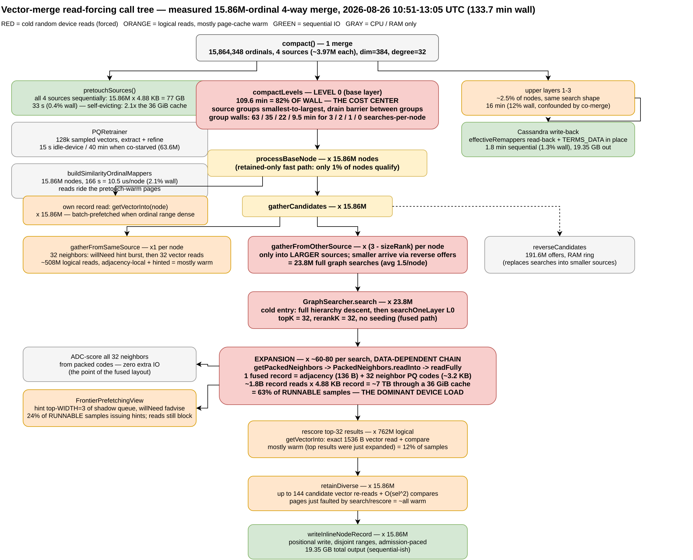
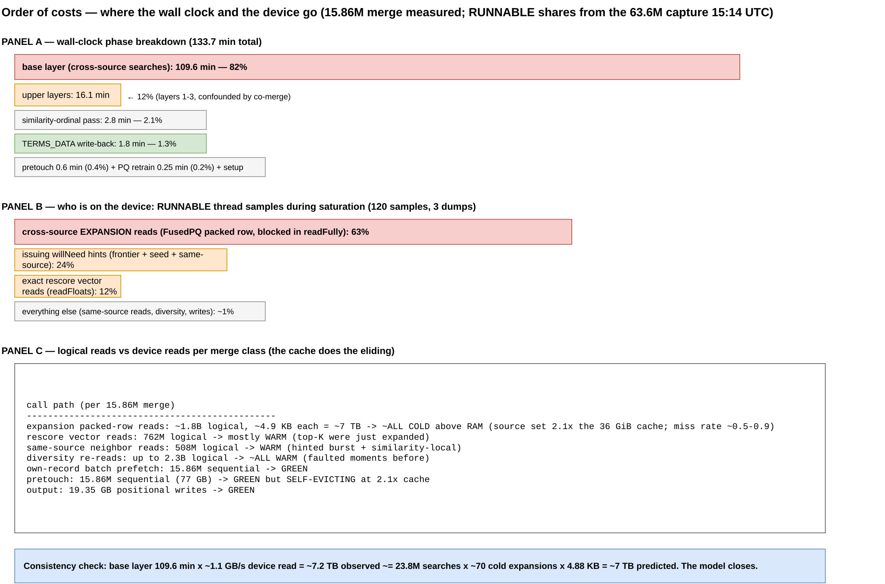
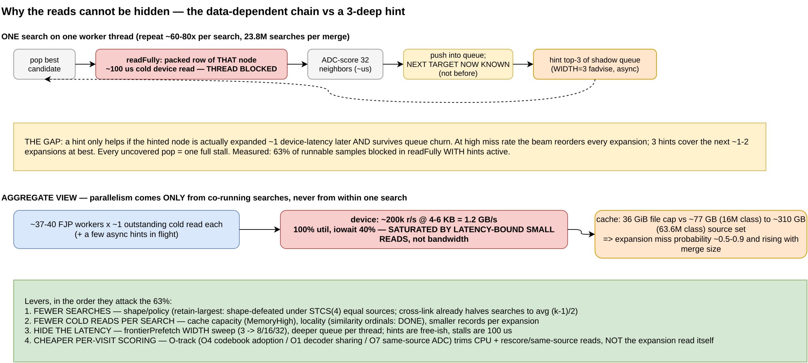

# How the vector-merge compaction algorithm forces its read path

**Date:** 2026-08-26 · **Author:** campaign session (Run C live)
**Code analyzed:** jvector `7de94e83` (branch `experiment/cluster-rescore-prefetch-20260824`, deployed jar md5 `33f1202c…`), Cassandra `4c29e7c6ee` + 29-file WIP tree.
**Live evidence:** Run C (`sessions/stcs_adaptive_20260826_034801`), table `baselines.ibm_datapile_1b_default`, dim=384, degree=32, 4-way STCS merges, similarityOrdinals=true, clusterSearch=false, cache capped at ~36 GiB file pages (MemoryHigh=146G).
**Anchor measurements:** the completed 15,864,348-ordinal merge (10:51:24–13:05:06 UTC, 133.7 min) and the 63.6M merge's saturation capture (`docs/captures/iosat-20260826-1514/`).

Companion documents: `vector-compaction-campaign/` (month scope), `vector-compaction-5day/` (5-day scope), `runwatch-20260826-runC.md` (live log). This one answers a narrower question in depth: **which calls, in what order, with what multiplicities, turn a merge into 200k random reads per second — and why the prefetch machinery cannot absorb them.**

---

## TL;DR

The merge's cost center is `compactLevels` level 0: **one full graph search into every *larger* source, for every node** (`gatherFromOtherSource`). Each search is a data-dependent walk that reads one ~4.88 KB fused record per expanded node (`getPackedNeighbors → PackedNeighbors.readInto → readFully`), ~60–80 expansions per search. For the measured 15.86M merge that is ~23.8M searches → order 10⁹ record reads → ~7 TB pushed through a 36 GiB cache: **63% of RUNNABLE thread samples sit blocked in that one read call.** Everything else — exact rescores (12%), same-source neighbor reads, diversity re-reads — mostly rides pages the searches just faulted in. Prefetch (frontier WIDTH=3 + seed hints) is active in every stack and covers almost nothing, because within one search the next read address does not exist until the current read is decoded. Parallelism, and therefore device queue depth, comes only from running ~40 searches at once — which is exactly the observed signature: ~200k r/s × 4–6 KB, 100% util, latency-bound.

---

## 1. The algorithm end-to-end, with the measured timeline

A vector merge (`OnDiskGraphIndexCompactor.compact`, called from Cassandra's `CompactionGraphMerger.merge`) runs these phases in order. Wall-clock shares are from the completed 15.86M-ordinal merge (`CompactionExecutor:44`, 10:51:24→13:05:06):

| # | phase | code | 15.86M measured | wall % | IO character |
|---|-------|------|------------------|--------|--------------|
| 1 | source pretouch | `pretouchSources` (L868) | 33.2 s | 0.4% | sequential, 77 GB, **self-evicting** (2.1× cache) |
| 2 | PQ retrain | `PQRetrainer` | 15 s | 0.2% | 128k sampled vector reads; **40 min on the co-starved 63.6M** |
| 3 | similarity-ordinal pass | `buildSimilarityOrdinalMappers` (L2800) | 166 s = 10.5 µs/node | 2.1% | rides pretouch-warm pages |
| 4 | **base layer (L0)** | `compactLevels` level 0 (L1365) | **109.6 min** | **82%** | **the read storm — this document's subject** |
| 5 | upper layers 1–3 | same, level ≥ 1 | 16.1 min | 12% | same shape, ~2.5% of nodes (confounded by co-merge) |
| 6 | write-back | Cassandra `CompactionGraphMerger` read-back + TERMS_DATA in place | 1.8 min | 1.3% | sequential, 19.35 GB |

Two structural facts about L0 set up everything below:

- **Source groups run smallest→largest with a drain barrier between groups** (`l0ProcessOrder`, L1458-64). The measured group walls — 63 / 35 / 22 / 9.5 min for groups doing 3 / 2 / 1 / 0 cross-source searches per node — are a direct, in-vivo measurement of what searching costs versus everything else.
- **The record is the unit of IO.** `vectorMergeBytesWritten=19,354,528,956` over `3,966,224` surviving ordinals ⇒ **4,880 B per node**: 1,536 B full vector (384×f32) + ~3.2 KB FusedPQ packed neighbor codes (`featureSize = compressedVectorSize × degree`, feature/FusedPQ.java L99) + 136 B adjacency (`(2+degree)×4`). Source graphs have the same layout. One node touched = one 4.88 KB read = one or two 4 KiB page faults — the observed 4–6 KB mean device request.

## 2. The call paths, and what each one forces

### 2.1 `processBaseNode` — ×N nodes (L1729)

For every live node of every source: read the node's own record (`getVectorInto`; covered by a *batch* prefetch when the batch's ordinal range is dense, L1673-88), then `gatherCandidates`, then diversity-select, then write. A **retained-only fast path** (L1741-47) skips all gathering for largest-source nodes that received zero reverse offers — but with 4-way equal-size merges, 70% of nodes receive offers and only **~1–4% of nodes qualify**, so the fast path is nearly inert in this shape.

### 2.2 `gatherFromSameSource` — ×1 per node (L2226)

Iterates the node's 32 existing neighbors twice: a `willNeedL0Record` hint burst, then 32 `getVectorInto` reads for exact scores. ~508M logical reads per 15.86M merge, but similarity ordering makes neighbors ordinal-local and the hint burst overlaps the faults — this path contributes ~nothing to blocked samples.

### 2.3 `gatherFromOtherSource` — ×(k−1−rank) per node (L2259): **the cost center**

Cross-link halves the naïve T×(k−1): at L0 a node searches **only sources larger than its own** (L2205-07); smaller sources' candidates arrive via `reverseCandidates` offers in RAM (191.6M offers, 16 slots/node). For 4 equal sources that is avg 1.5 searches/node = **23.8M full searches** per 15.86M merge.

With the fused (SAI) output path, seeding is disabled (`setupSeeding` only when `!fusedPQEnabled`, L1396) and clusterSearch is gated off this run — so every search takes the **cold branch** (L2320-26): `GraphSearcher.search(ssp, topK=32, rerankK=32)` — full hierarchy descent from the source's global entry, then beam search on L0.

**Per expanded node, exactly one forced read.** The searcher scores neighbors via `FusedPQDecoder.enableSimilarityToNeighbors`, which calls `View.getPackedNeighbors` → `FusedPQ$PackedNeighbors.readInto` → `readFully` — one contiguous ~3.3 KB slice (adjacency + all 32 neighbors' PQ codes) of the expanded node's record. That single read yields ADC scores for all 32 neighbors with **zero further IO** — the fused layout's point. The price: the read is **demand-faulted and data-dependent**, because which node gets expanded next is decided by scores computed *from the previous read*.

### 2.4 `rescore` — ×topK per search (L2410)

The cold branch rescores each of the 32 returned candidates with an exact vector read (`getVectorInto`, 1,536 B) + float compare. ~762M logical reads per 15.86M merge, **mostly warm**: top results are usually nodes the search just expanded, whose records are seconds-old page-cache entries. Measured: 12% of blocked samples.

### 2.5 `retainDiverse` — ×N (L3051)

Re-reads up to ~144 candidate vectors per node (alpha rounds over the candidate list) for candidate-vs-selected compares. Up to ~2.3B logical reads — virtually all warm (faulted moments earlier by search/rescore). CPU-visible, IO-invisible.

### 2.6 `pretouchSources` — ×1 per merge (L868)

With `sourcePretouchMaxNodes=-1` it streams **every** source record once, sequentially, in 1M-node windows. 15.86M merge: 77 GB in 33 s. 63.6M merge: **310 GB in 229 s** — into a 36 GiB cache, i.e. it evicts itself ~8× over and finishes with only the last ~36 GiB resident (the tail of the last source). It also evicts whatever the *co-running* merge had warm. Its one durable benefit in this shape is warming the ordinal pass (phase 3) which runs immediately after. Above cache capacity this knob is at best a 0.4%-wall sequential warm of the wrong pages and at worst an eviction attack on the concurrent merge.

## 3. The arithmetic

Per-search thread time, from the group walls: group with 1 search/node took 22.4 min wall; the 0-search group's 9.5 min is the non-search baseline ⇒ search-only ≈ 12.9 min × 40 workers / 3.97M searches ≈ **7.8 ms of thread time per search** ≈ 60–80 expansions × ~100 µs cold-read latency (plus CPU). The device-side check: base layer 109.6 min at the observed ~1.1 GB/s ⇒ ~7.2 TB ≈ 23.8M searches × ~70 cold reads × 4.88 KB ≈ 7.0 TB. The model closes to within its error bars (exact attribution is impossible with `concurrent_builds=2` — the 63.6M's pretouch/PQ/ordinal phases shared this window).

Scaling in N is built into the structure: searches ≈ N × (k−1)/2 (equal sources), expansions/search grow only ~logarithmically with source size, and the miss rate saturates near 1 once sources ≫ cache. That predicts near-linear min/M across size classes above RAM — which is what Run C measures (16M class ~4.5–4.8 min/M; 63.6M running ~3.6–4.0 min/M base-layer clip).

## 4. Why prefetch cannot cover it

Three prefetch mechanisms are live in this build, all visible in the capture — and 63% of samples still block in `readFully`:

1. **Frontier hints** (`FrontierPrefetchingView`, WIDTH=3 default, property `jvector.compaction.frontierPrefetch`): after each expansion, fadvise the top-3 shadow-queue candidates. But the beam reorders on every expansion; a hint helps only if its node is still the best ~100 µs later. 3-deep covers ≈1–2 future expansions.
2. **Seed hints** (`CROSS_SOURCE_SEED_PREFETCH`): dead in this configuration — the fused path never takes the seeded branch (§2.3).
3. **Batch prefetch** (`computeBaseBatch`): covers each node's *own* record only — by design, because "search reads into other sources are data-dependent and stay demand-faulted" (comment at L1666-70).

The structural statement: **within one search there is no lookahead to exploit** — address n+1 is a function of the bytes at address n. All device concurrency comes from co-running searches: ~40 workers × ~1 outstanding read ≈ 200k IOPS at 4–6 KB. That saturates the array with small latency-bound reads while using ~40% of its large-request bandwidth. This is the same mechanism as the 2026-08-23 collapse captures — the call site simply moved from `clusterSearchL0` to the plain symmetric search when the cluster gate closed.

## 5. What attacks which term

| lever | attacks | status |
|---|---|---|
| fewer searches: retain-largest / merge-shape policy | the 23.8M multiplier | shape-defeated under STCS(4) equal sources (25% base share < 0.5 gate); cross-link elision already halves it |
| cache capacity (MemoryHigh) | miss rate | deliberately constrained on this rig to provoke the above-RAM regime; the production lever is RAM |
| locality (similarityOrdinals=true) | misses per expansion | **deployed this run** — neighbors cluster on nearby ordinals/pages |
| frontierPrefetch WIDTH 3→8/16/32 | stall per miss | the sweep this document re-motivates; hints are cheap, stalls are 100 µs |
| O-track: O4 codebook adoption, O1 decoder sharing, O7 same-source ADC | CPU per visit, rescore & same-source reads | queued behind Run C; does **not** remove the cross-source expansion read itself |
| pretouch policy | phase-1 waste / co-merge eviction | consider `sourcePretouchMaxNodes` ≈ cache size or 0 above capacity |

## 6. Provenance

- Group walls, phase timeline: `/var/log/cassandra/compaction.log` lines 10:51:24–13:05:06 UTC (`CompactionExecutor:44`), quoted in `runwatch-20260826-runC.md`.
- Record size: `CompactionGraphMerger measurement: vectorMergeBytesWritten=19354528956, vectorMergeSurvivingOrdinals=3966224` (08:58:34).
- RUNNABLE shares: 3× `jcmd Thread.print` at 15:14 UTC during the 63.6M base layer, grouped in `docs/captures/iosat-20260826-1514/` (76/29/15 of 120 samples); pidstat attribution ~37 FJP workers × ~32 MB/s.
- Code line references: jvector `7de94e83` `OnDiskGraphIndexCompactor.java` (constants L65-69; pretouch L868; compactLevels L1365; batch prefetch L1673-88; retained-only L1741-47; gatherCandidates L2185; same-source L2226; other-source L2259; rescore L2410; diversity L3051), `FrontierPrefetchingView.java` (WIDTH L59), `feature/FusedPQ.java` (featureSize L99); Cassandra `FileHandleReaderSupplier.java` (prefetch/willNeed implementations).
- Diagrams: `figures-readpath-20260826/*.drawio` (sources) rendered to PNG via `rlespinasse/drawio-export` (local docker).
